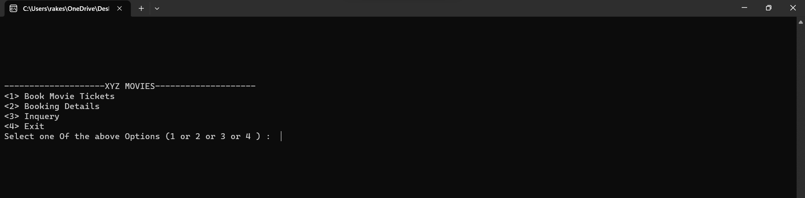
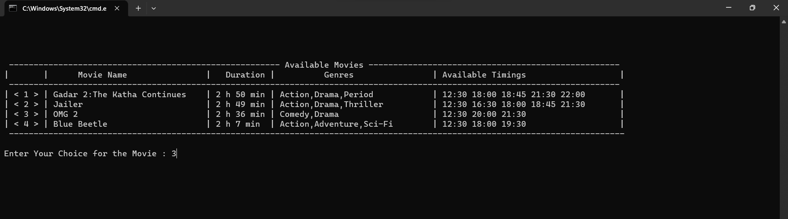
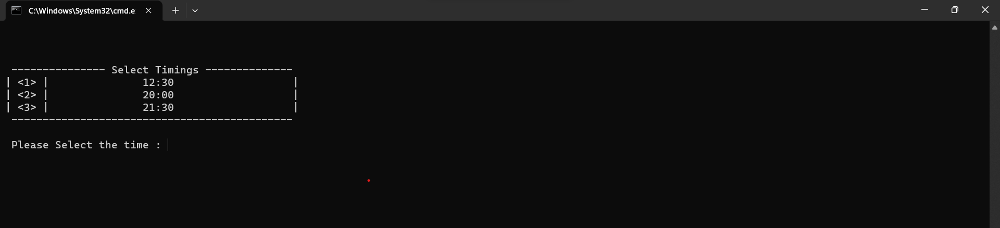
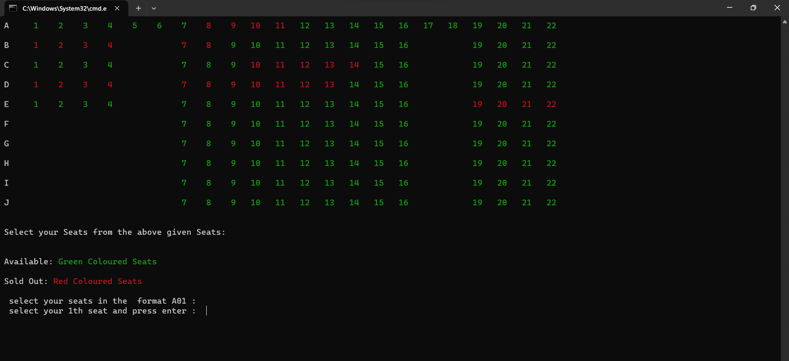
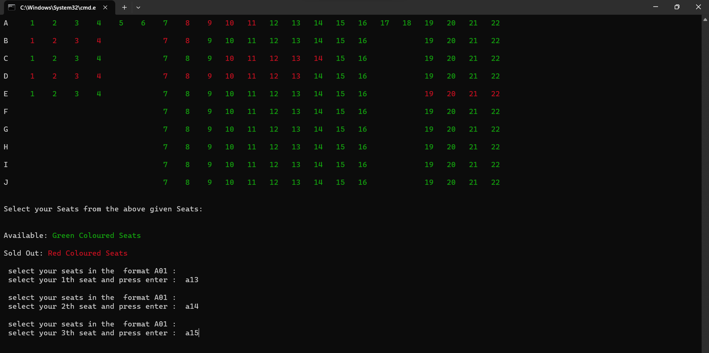
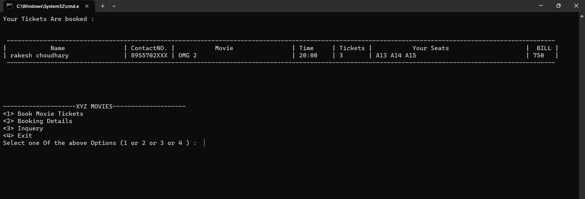
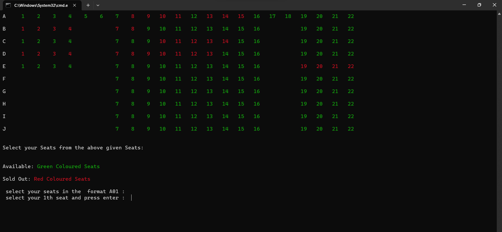
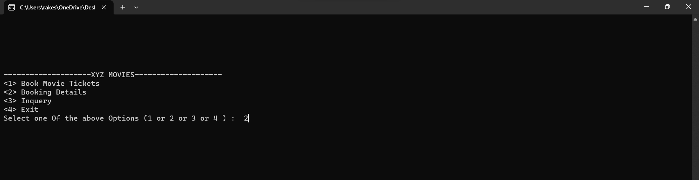
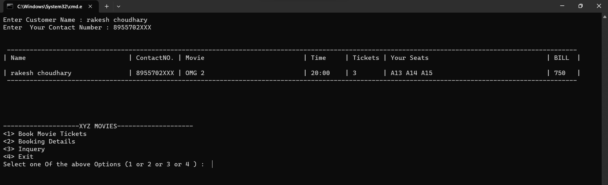
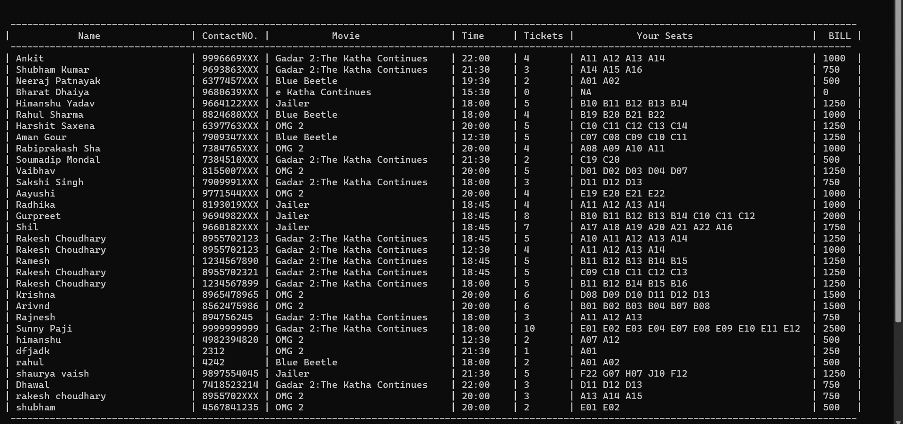

# Movie-Booking-System

Movie Booking System in C++ using Object-Oriented Programming and File Handling.

Introduction:-
Movies are a popular form of entertainment for people of all ages. In recent years, there has been a growing trend of online movie booking systems. 
These systems allow users to book movie tickets from the comfort of their own homes.
This project is a simple movie ticket booking system that uses object-oriented programming (OOP) and file handling in C++. 
The system allows users to book movie tickets, view movie show details, view their tickets. 

The system has three text files:

   &emsp;•	Customer

   &emsp;•	 Seats

   &emsp;•	Movie

  
Files

1.	  Customer.txt   
This file acts as a repository for customer information who have successfully booked tickets. Each entry consists of thecustomer's name,
 contact details, chosen movie, showtime, number of tickets, payment, and selected seats.

3.	  Seats.txt   
This file serves as the visual representation of the theaters seating arrangement. It dynamically updates to showcase seat availability,
indicating whether a particular seat has been booked or remains unoccupied.

5.	  Movie.txt
This file houses comprehensive data about the available movies, encompassing aspects such as the movie title, duration, genres and show timings.

  
Object-Oriented Design:

The project's architecture is guided by the following key classes:
    
1.	 Customer
	 
&emsp;&emsp;•	Name

&emsp;&emsp;•	ContactNo

&emsp;&emsp;•	Movie

&emsp;&emsp;•	Time

&emsp;&emsp;•	No_Tickets

&emsp;&emsp;•	Payment

&emsp;&emsp;•	Seats

 
3.	Movie

&emsp;&emsp;•	M_name

&emsp;&emsp;•	Duration

&emsp;&emsp;•	Gernes

&emsp;&emsp;•	Avail_timings

 
4.	Movie_show

&emsp;&emsp;•	M_name

&emsp;&emsp;•	Show_time

&emsp;&emsp;•	Seats

  
Workflow

1.	Upon initiation, the program reads movie details from   movie.txt, creating instances of the Movie class with specified attributes.
2.	Users are presented with an array of available movies and their        comprehensive details, including genres and show timings.
3.	Customers can select their desired movie, providing personal information, preferred showtime, and the number of tickets required.
4.	The BookingSystem utilizes the Movie_Show class to assess seat availability. Customers are then guided through the selection process, aided by a dynamic representation of seats.
5.	Green seats signify availability, while red seats indicate a sold-out status.
6.	Once the customer confirms their booking, the system records information in the customer.txt file and updates seat availability in the seats.txt file.

•	Enter 1 to Book Movie tickets and the List of Available Movies Appears. 

 

•	Select the Movie from These Available Movies. 

 

•	Then select the  Time of the show. 

 

From these given Seats select the Seats .
 Red Coloured Seats Are Sold out
 Green Coloured  Seats Are Available 

 

•	Select Seats from the Available Seats. 

 

•	The details of the booked tickets. 

 

•	These Booked Seats A13, A14, A15 are coloured Red. 

 

•	check booking Details by selecting option 2. 

 

•	Get the booking details corresponding to the Name and Contact Number. 

 

•	This is the information for all the booked tickets. 

 
